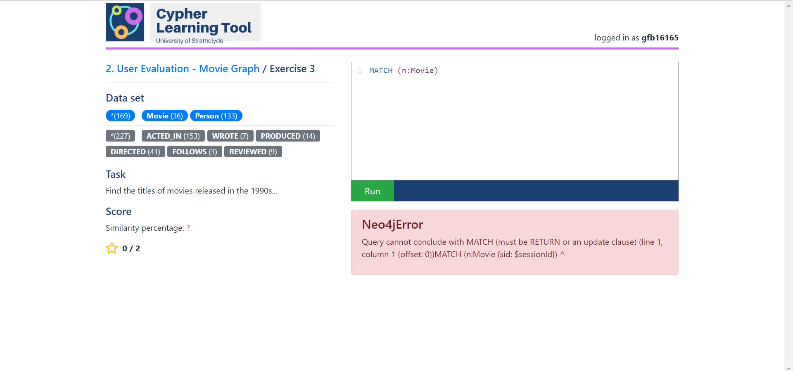

# KUPK07 - Cypher Learning Tool
This project aims to produce software that supports the teaching of Neo4j (the leading graph database) and the standard query language for it - Cypher, in an interactive manner. The project will accommodate both students' and teacher's needs.

Prerequisites:
*  Have Node.js and NPM installed.
*  Have Neo4j Desktop installed on localhost.
*  Create new Graph and have it run on bolt://localhost:7687.

# Screenshots

# To build the project:
1.  Navigate to the project root directory and open a shell.
2.  Execute `npm install`.
2.  Configure authentication token in ./config/db.js - `neo4j.auth.basic("user", "password")`.
	
# To run the app:
*  `npm run dev` - Development environment
*  `npm run start` - Production environment